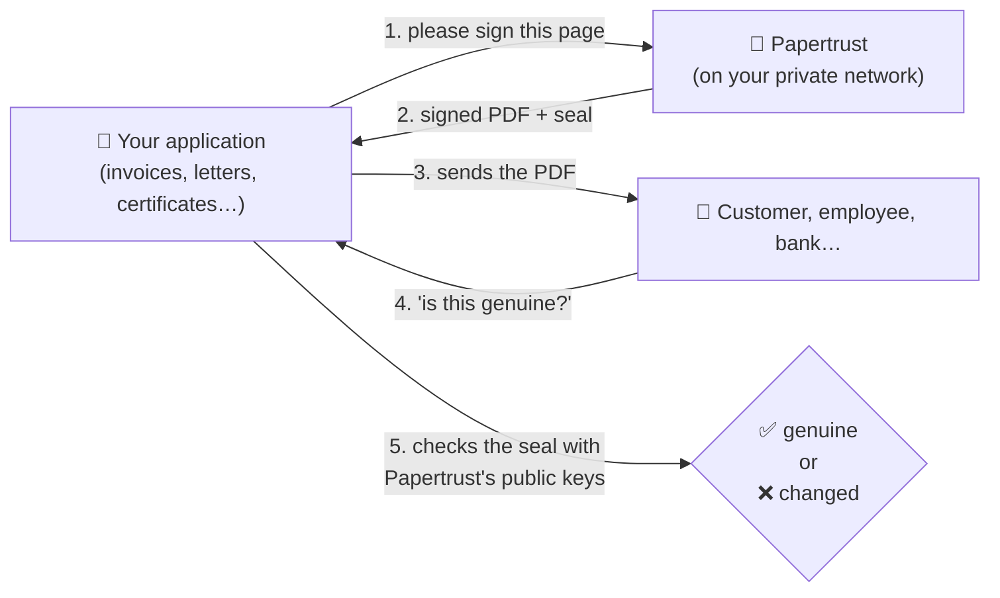
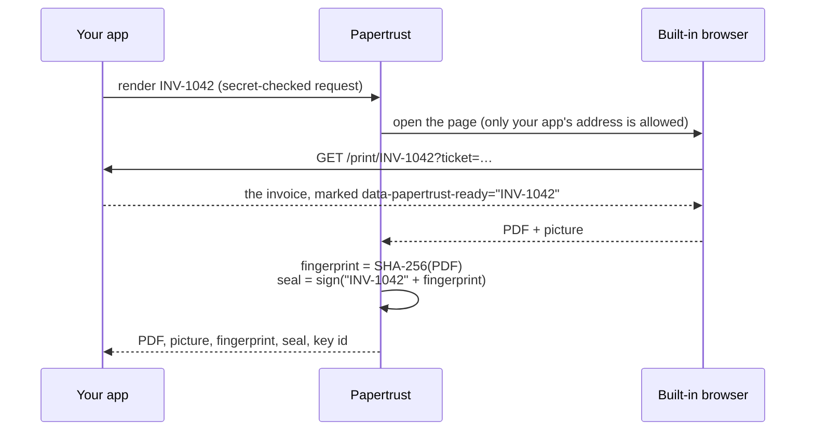
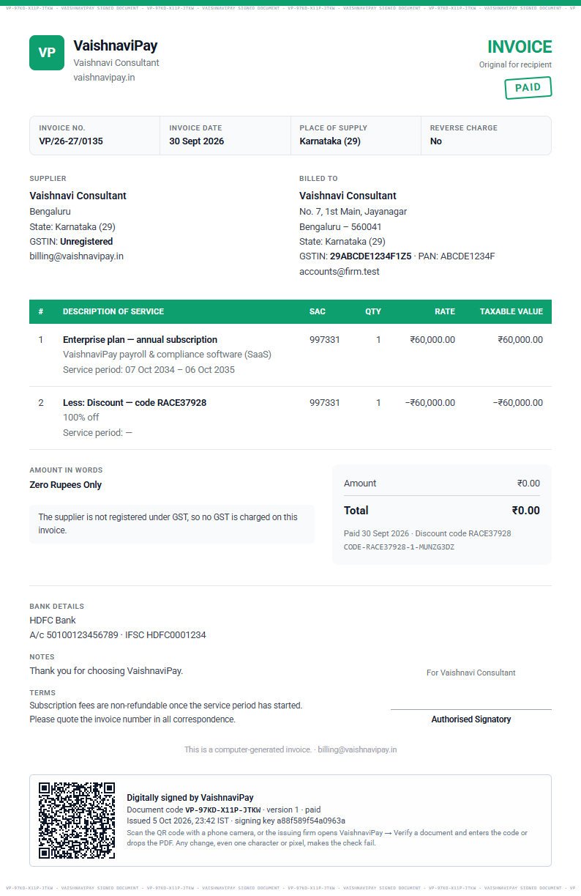
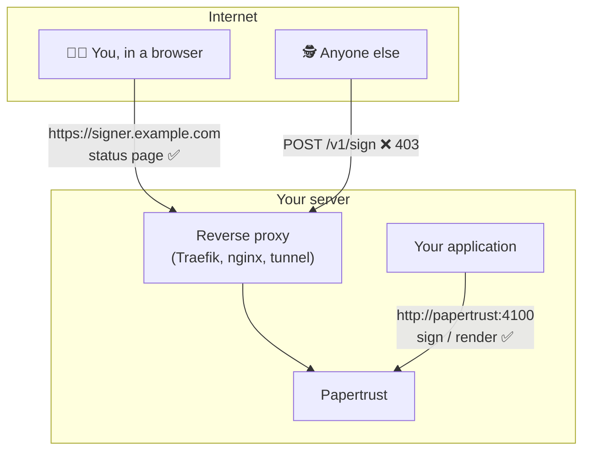
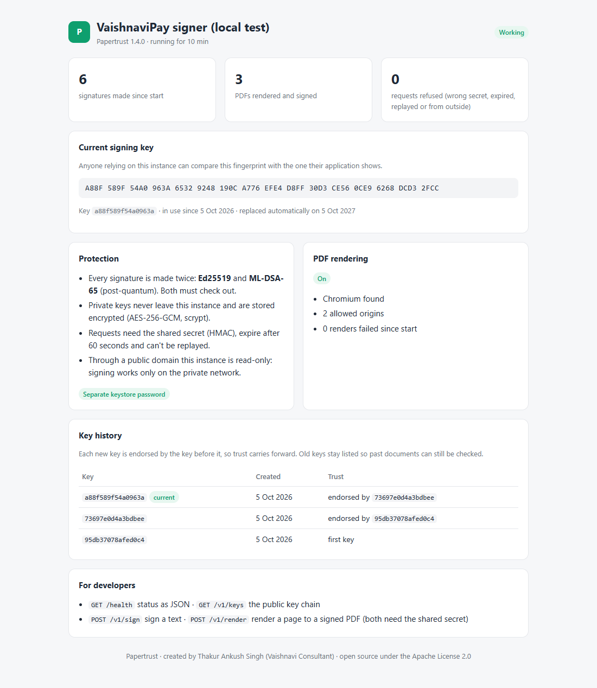
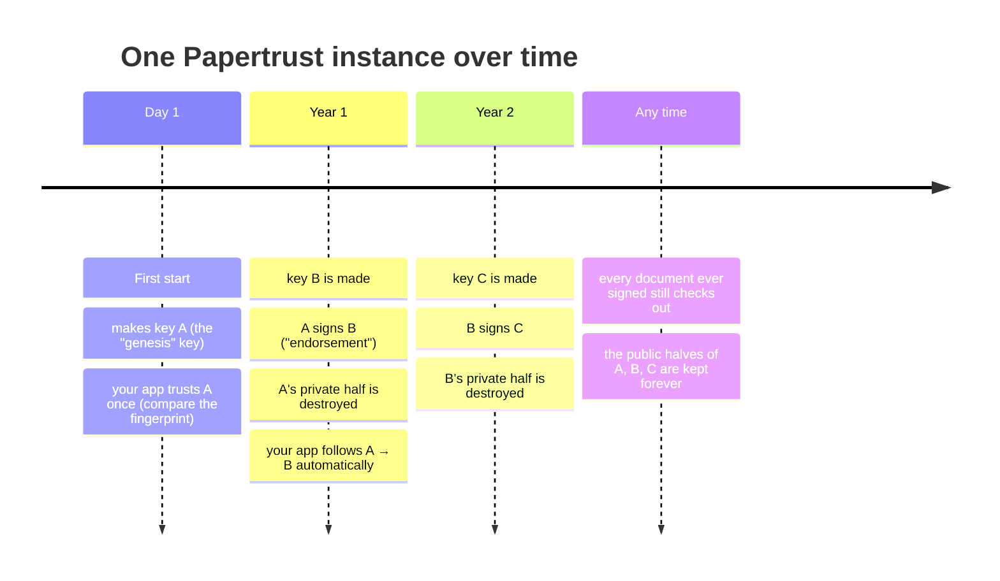

# How Papertrust works, in plain words

This guide explains Papertrust without assuming you know cryptography. If you just want to install it, the [README](../README.md) has the steps. This page is about **what happens and why you can trust it**.

---

## The idea in one picture

Think of Papertrust as a **notary that lives on your server**. Your application hands it a page; the notary turns it into a PDF, stamps it with a seal only it owns, and remembers nothing but its seal. Later, anyone holding the PDF can check the seal. If even one character or pixel was changed, the seal no longer fits.



**What makes the seal special:**

- **It's yours.** Every Papertrust installation makes its own keys. No company, certificate authority or subscription is involved.
- **It can't be copied.** The secret half of the key never leaves Papertrust, and it is stored encrypted.
- **It's doubled.** Each seal is made with two different methods: **Ed25519**, today's standard, and **ML-DSA-65**, designed to survive future quantum computers. Both must check out.
- **It covers every byte.** The seal is made over a fingerprint (SHA-256) of the whole file. Change anything, even re-saving it in another program, and the fingerprint changes.

---

## A worked example: one invoice, from start to finish

**1. Your application asks for a signed PDF.**

```http
POST http://papertrust:4100/v1/render
x-papertrust-time: 1791200000000
x-papertrust-signature: 6f1c…  (proves the request came from your app)

{ "url": "http://myapp:3000/print/INV-1042?ticket=…", "label": "INV-1042" }
```

**2. Papertrust opens that page in its own built-in browser, prints it to PDF, and seals it.**



**3. The answer.** Your app stores it next to the invoice:

```json
{
  "kid": "a88f589f54a0963a",
  "sha256": "afa5a763a69b6752ac6df304ba607ca5a2ab87142ebd…",
  "signature": { "ed25519": "mQ2xxGsJjz6koi…", "mldsa65": "Fh3k…(4 412 characters)…" },
  "pdf": "<base64>", "png": "<base64>"
}
```



*An example from an application using Papertrust: the page is printed exactly as shown, the application adds its own QR code and document code, and the PDF is sealed.*

**4. Months later, someone sends the PDF back and asks "is this ours?"** Your application:
1. computes the SHA-256 of the file they sent;
2. finds that fingerprint among its stored invoices;
3. checks the seal with Papertrust's public key: `verifyPair(publicKeys, "file", "INV-1042\n" + sha256, signature)`.

All three succeed only for the exact original. A single changed pixel gives a different fingerprint, so step 2 finds nothing.

---

## Two doors: why the public address can't sign



- **The private door** (`http://papertrust:4100`, inside your Docker network) is the only one that can sign, and only with the shared secret. Every request expires after 60 seconds and can't be replayed.
- **The public door** (an optional domain) is **read-only**. It shows the status page, health and public keys, nothing more, even to someone who knows the secret. Papertrust can tell the two apart because a proxy always adds forwarding headers.



---

## Keys over the years (no master key, no authority)



- **Nobody holds a master key.** There's nothing to lose in a drawer and nobody to bribe.
- **Trust carries forward on its own.** Each new key is endorsed by the previous one, so applications never need re-configuring.
- **A stolen old backup can't sign new things**, because old private keys are destroyed.
- **If the keystore is ever lost**, Papertrust starts a brand-new identity. Applications refuse it until a person compares its fingerprint and confirms it. A new key that nobody vouched for is never trusted silently.

---

## What is stored, and where

| Where | What | Secret? |
|---|---|---|
| Papertrust's `/data/keystore.json` | Its keys: the current private key (encrypted with AES-256-GCM, password stretched with scrypt) and the public halves of all keys | The private key: **yes** |
| Your application | The PDFs, fingerprints, seals and key ids, plus the public keys it trusts | No (private to you) |
| Nowhere | The documents Papertrust renders: it keeps no copy, no database, no logs of content | — |

So the only thing to protect on Papertrust's side is `/data` plus its password, **kept separately**.

---

## What it can and can't prove

| ✅ It proves | ❌ It does not prove |
|---|---|
| This exact file was issued by this installation | That what the document says is true or correct |
| Not one byte changed since | That a **printout** is unchanged (paper can't be fingerprinted; compare it with your stored original, or put a signed QR code on it) |
| When it was signed, and with which key | Who typed the content in your application (that's your app's audit trail) |

---

## Questions people ask

**Is this like Adobe PDF signatures?** It's a different model. Adobe-style signatures live inside the PDF and are checked against commercial certificate authorities. Papertrust seals the exact bytes, and *you* (or anyone with your public keys) check them, with no outside party.

**Can someone run Papertrust and pretend to be me?** They can run the software, not your keys. Their seals won't match your public keys.

**What if my server is hacked?** While an attacker controls it, they could get new things sealed, as with any signing system. They still can't alter documents you already issued without detection. Rotate the key and investigate.

**Does it need the internet?** No. It makes no outgoing connections, and while rendering it blocks every address except your application's.

**Which languages can verify the seals?** Any language with Ed25519 and ML-DSA-65 (for example OpenSSL 3.5+). The exact byte formats are in the [README](../README.md#formats-for-implementations-in-other-languages).

---

Papertrust is created by **Thakur Ankush Singh (Vaishnavi Consultant)** and released under the Apache License 2.0. See [NOTICE](../NOTICE).
